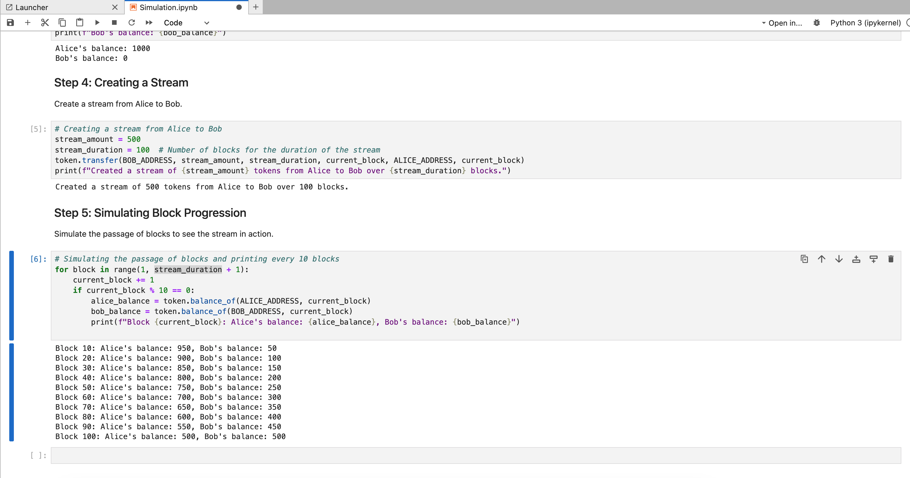

# Python Streamable Token for Cartesi rollups

Made with ❤️ by [DCA.Monster](https://dca.monster) as part of the Cartesi Grant [DCA.Monster: Modular DeFi 2.0 Components for Cartesi](https://governance.cartesi.io/t/dca-monster-modular-defi-2-0-components-for-cartesi/210)

## Video Tutorial

If you're looking for a more interactive way to learn about our Python Streamable Token implementation for Cartesi Rollups, check out our video tutorial!

[](https://www.youtube.com/watch?v=37opGYoXHgU "Watch our video tutorial on YouTube")

_Click on the image above to watch the video on YouTube._

## Introduction

StreamableTokens on Cartesi represent a groundbreaking advancement in blockchain technology. Typically, blockchain applications on Ethereum Virtual Machine (EVM) compatible chains are constrained by computational limits, restricting the scope and efficiency of many potential use cases. However, by leveraging Cartesi's rollups, we're not just overcoming these limitations but also unlocking a realm of possibilities previously unattainable in the blockchain space.

The core of our excitement lies in the versatility and continuous transaction capabilities that StreamableTokens offer. This technology enables real-time, ongoing transfer of digital assets, a significant leap from traditional lump-sum transactions. It's particularly transformative for DeFi applications, where the need for regular, uninterrupted payments — like subscriptions, salary distributions, or rent — is paramount.

Our Python-based solution for StreamableTokens in Cartesi is crafted with an emphasis on technical efficiency and adaptability. These tokens are designed for high composability, ensuring their seamless integration with various decentralized applications (DApps), including DEXes, money markets, and gaming platforms. By providing developers with a robust and flexible framework, we're not just replicating existing use cases but also encouraging the exploration of new, innovative applications in the blockchain ecosystem. This marks a significant step forward in our journey towards a more dynamic and versatile blockchain future.

## Core Features

- **Python Standardized Implementation**: Built with Python, focusing on compatibility with the Cartesi rollup platform.
- **Support for Infinite Streams**: Engineered to handle a vast (almost infinite) number of ongoing streams and real-time balance computations.
- **SQLite Database Integration**: Utilizes SQLite database for efficient data management and storage.

- **Description**: A python standardised implementation of a Cartesi Streamable token based on [SuperfluidToken](https://github.com/superfluid-finance/protocol-monorepo/blob/dev/packages/ethereum-contracts/contracts/superfluid/SuperfluidToken.sol) on-steroids that can handle a very high (almost infinite) number of ongoing streams and realtime balances. (See [realtimeBalanceOf](https://github.com/superfluid-finance/protocol-monorepo/blob/4e0833900fa51d2dd82cc1be55d97e43d64451f7/packages/ethereum-contracts/contracts/superfluid/SuperfluidToken.sol#L72C6-L72C6))
  - **Features**:
    - Standardised interface to have high composability with Cartesi DApps
    - Work seamlessly with Cartesi’s InputBox & Vouchers
    - Infinite (or extremely high) open streams that working graciously to allow building more sophisticated applications with them.
    - Utilizes SQLite database for efficient data management and storage.
  - **Benchmarking**:
    - Objective: Performance evaluation with high demand this number should support for a DEX operating at peak demand. Support at least 25,000 simultaneous token streams.
  - **Use Cases**:
    - Programmable transfers (e.g. send X tokens at specific time during X seconds)
    - Subscription Services: Manage ongoing subscription payments.
    - DEX

## Key Components

1.  [**StreamableToken**](./dapp/streamabletoken.py): Main class that manages the token streaming logic, including stream creation, balance calculations, and token minting/burning.
2.  [**Stream**](./dapp/stream.py): Represents an individual stream, holding details like start block, duration, amount, and the addresses involved.
3.  [**Database Functions**](./dapp/db.py): A set of functions to interact with the SQLite database, managing token, account, and stream data.
4.  [**Dapp**](./dapp/core.py): Example DApp that demonstrates the StreamableToken functionality: minting tokens, creating streams, transferring tokens between accounts and withdrawing tokens from the cartesi rollup.

## Usage

If you want to use the StreamableToken in your python, just copy the [streamabletoken.py](./dapp/streamabletoken.py) file into your project and import it.

```python
from streamabletoken import StreamableToken
```

Then you can create a new instance of the StreamableToken class:

```python
token = StreamableToken(sqlite_connection, token_address)
```

And start using it:

```python
# Mint 100 wei tokens
amt = 100
receiver = "0x..."
token.mint(amt, receiver)

token.transfer(
  receiver=receiver,
  amount=amt,
  duration=3600, # 1 hour
  block_start=current_block+25,
  sender=sender,
  current_block=block_number,
)
```

## Simulation

We have set up a Notebook to show you how easy it's to use the Streamable tokens and transfer them between accounts.

You just need docker installed and run the following command:

```bash
make notebook
```

And among the output you will see something like:

```bash
[I 2023-11-13 18:22:56.212 ServerApp]     http://127.0.0.1:8888/lab?token=92b7eeb31f49fc54f871597bda570971b96f642476ededdc
```

Just copy the URL and paste it in your browser and you will be able to see the notebook.

Then in the notebook open the file [Simulation.ipynb](./Simulation.ipynb) and follow the instructions.



## Benchmarking

We have established a benchmarking script to evaluate the performance of the Streamable Token implementation. This script is configured to generate a pre-defined number of streams and is tasked with calculating the time required to integrate a new stream. Adding this new stream necessitates iterating over all active streams to verify the available balance prior to the addition of the new stream and this is what the benchmarking script measures.

To facilitate this, a new column has been introduced in the Input, Report, and Notice tables within the rollup PostgreSQL database. This addition aims to precisely time each new data insertion. See the docker-compose specific section of the [docker-compose.yml](https://github.com/dcamonster/cartesi-defi-modular-components/blob/master/docker-compose.yml#L251) file for more details.

Subsequently, the duration of a specific operation within the rollup is determined by comparing the timestamps of the most recent input and report.

Further details about the benchmarking script are available in the [benchmark folder](./benchmark)

To execute the benchmarking script, the following commands are required:

```bash
cd benchmark
yarn install
yarn start --streamNumber 25000 # or any other number of streams
```

By default, the benchmark tests 25,000 simultaneous streams, aligning with the intended benchmarking objective. However, this number can be modified by passing the `--streamNumber` flag.

Results running the Dapp in production mode:

| Test Run | Number of Simulateneous Streams | Time to Integrate New Stream (s) | Notes                                  |
| -------- | ------------------------------- | -------------------------------- | -------------------------------------- |
| 1        | 25,000                          | 3005 ms                          | 25k simultaneous streams goal achieved |
| 2        | 100,000                         | 3005 ms                          |                                        |
| 3        | 500,000                         | 3004 ms                          |                                        |
| 4        | 1,000,000                       | 3005 ms                          |                                        |
| 5        | 5,000,000                       | 3004 ms                          |                                        |
| 6        | 10,000,000                      | 3006 ms                          |                                        |

The benchmarking results indicate a consistent and robust performance of the Streamable Token implementation, as seen in the time taken to integrate new streams in a complex system with varying numbers of simultaneous streams. Notably, the time to integrate a new stream remains constant at approximately 3005 milliseconds, regardless of the number of streams, ranging from 25,000 to 10,000,000. This consistency suggests excellent scalability and efficiency in handling large-scale operations within the system. The implementation effectively maintains its performance even as the scale of operations increases significantly.

### Setting Up

Ensure you have Docker and Docker Compose installed on your machine. Check the Cartesi requirements documentation for more details [here](https://docs.cartesi.io/cartesi-rollups/build-dapps/requirements/).

### Running the Application

You can build the application in host mode for development purposes using the following command:

#### Host Mode

In one terminal run the cartesi rollup stack:

```bash
make host
```

In another terminal run the actual dapp:

```bash
python -m venv venv
source venv/bin/activate
pip install -r requirements.txt
make host-python-debug
```

#### Production Mode

You can also run the application in production mode using the following command.

First build the cartesi machine with:

```bash
make build
```

Then run the cartesi rollup stack:

```bash
make dev
```

## Testing

Run unit tests using `python -m unittest discover -s tests`. Continuous testing can be achieved with `find . -name '*.py' | entr -c make test`.

## Development and Contributions

Contributions to the project are welcome. Please adhere to the coding standards and guidelines provided in the documentation. Use the provided Docker environment for a consistent development setup.
